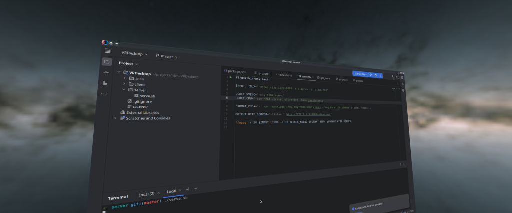

# VR Desktop

A simple VR Desktop using A-Frame and FFmpeg. It is only a proof of concept.

## Installation

```bash
# From ./client/
npm install
```

## Usage

Start the server:

```bash
# From ./server/
./serve.sh
```

Start the client:

```bash
# From ./client/
npm dev
```

## Demo



## Issues

- The browser buffers the video stream, so the video latency is too high.